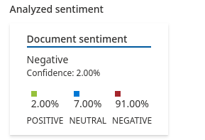
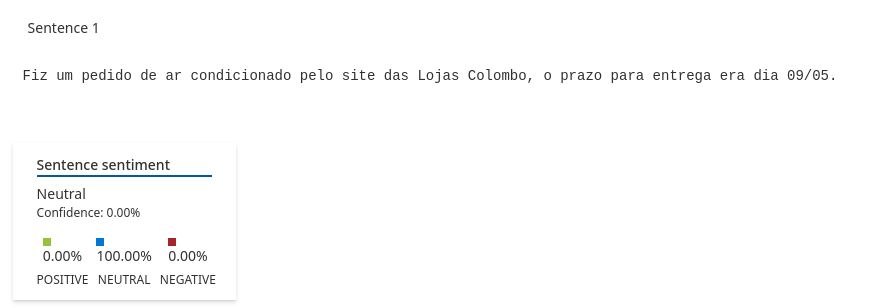
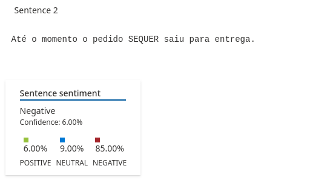
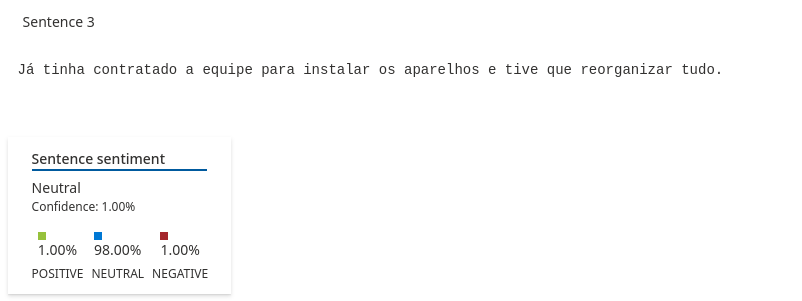
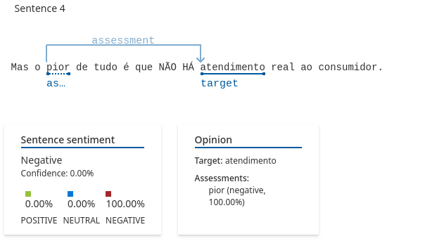
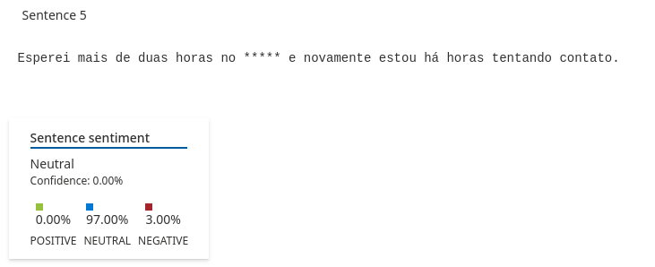
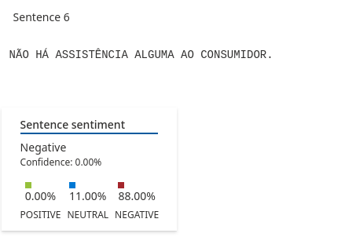

# Análise de Sentimento

Para essa análise, utilizei [essa reclamação](https://www.reclameaqui.com.br/lojas-colombo-loja-online/pedido-atrasado-e-zero-atendimento-ao-consumidor_tluPlJKYIx6ZTBD9/), pega do site Reclame Aqui.

## Análise Geral
Olhando a análise geral, vemos que o texto possui um sentimento negativo

## Sentença 1
A sentença apenas informa um fato (compra e entrega), sem expressar emoção. Ela foi corretamente classificada como neutra.

## Sentença 2
A sentença mostra uma reclamação sobre o não cumprimento do prazo de entreg. A palavra "SEQUER" põe ênfase no atraso e sugere frustração.

## Sentença 3
Embora essa situação possa ser frustrante, o texto é apresentado de forma objetiva e factual. Não há adjetivos ou termos que demonstrem alguma emoção. Não discordo da análise neutra, pois, por mais que tenha sido um incoveniente, o cliente pode ter se mantido neutro quanto à isso.

## Sentença 4
A sentença mostra que não houve atendimento ao cliente. Ela elencou como sentimento ruim. Ela sugere que "pior" está ligada ao "atendimento", de maneira à intensificar um ponto negativo.

## Sentença 5
Mesmo descrevendo uma longa espera, a frase é classificada como neutra. Provavelmente porque não há adjetivos ou termos fortes como "insuportável", "péssimo", etc. No entanto, subjetivamente ela pode ser vista como parte de uma experiência negativa.

## Sentença 6
Frase em caixa alta com negação absoluta (“NÃO HÁ... ALGUMA”) é uma forte crítica. A sentença mostra extrema frustração com a ausência de suporte ao consumidor.

