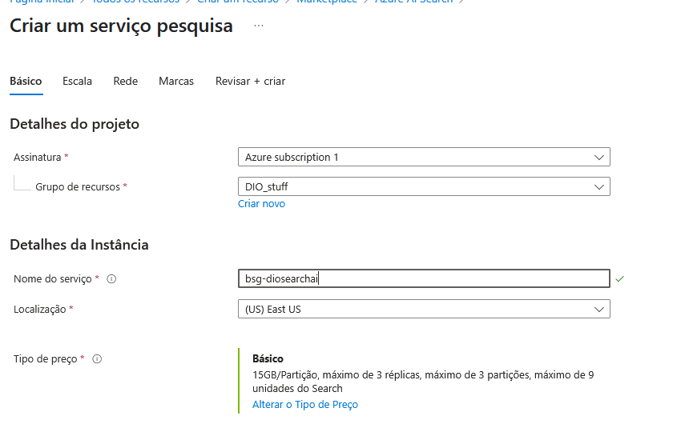
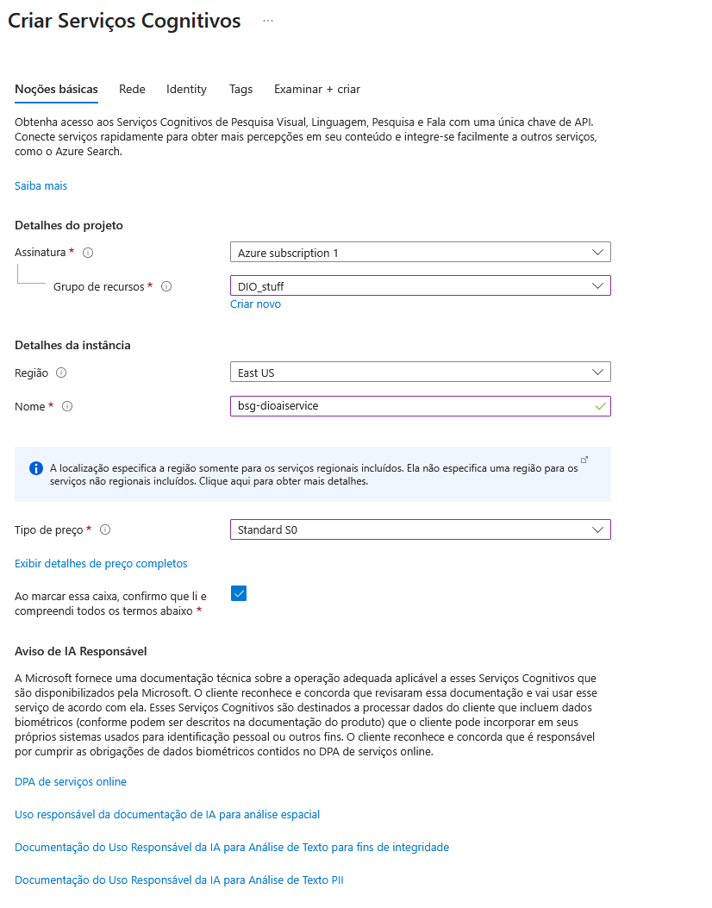
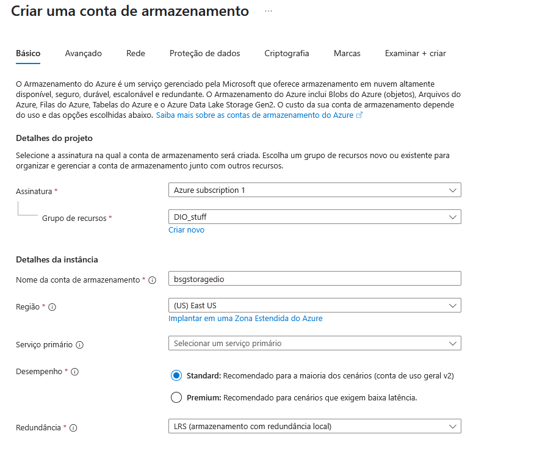
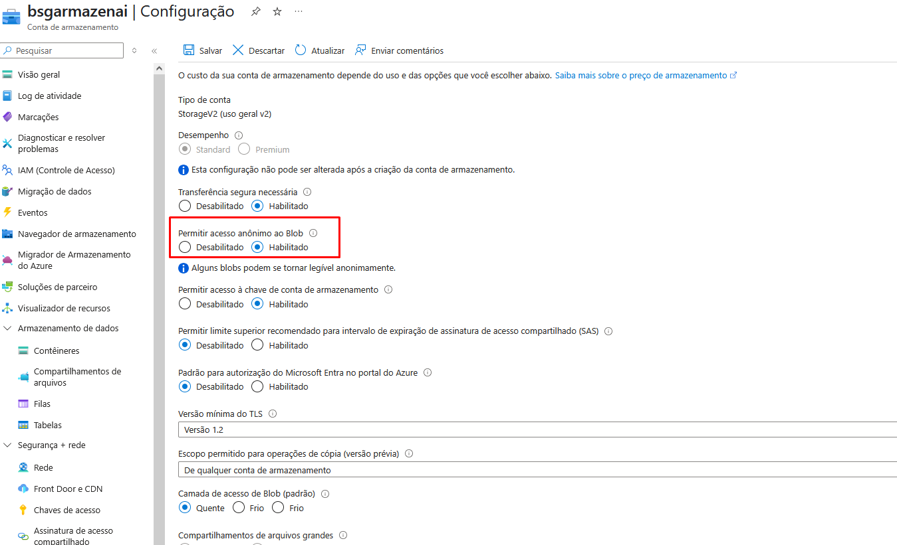
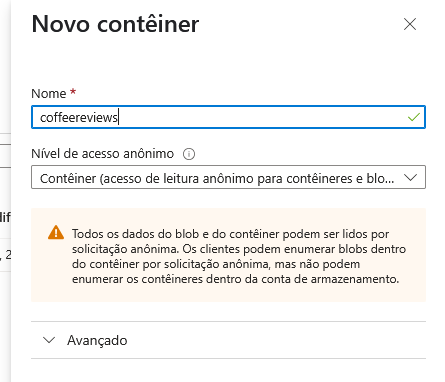
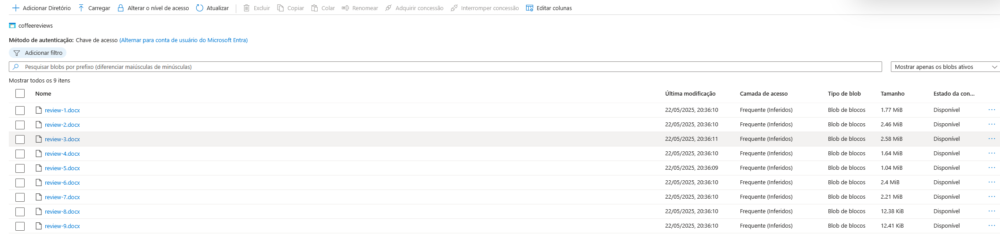
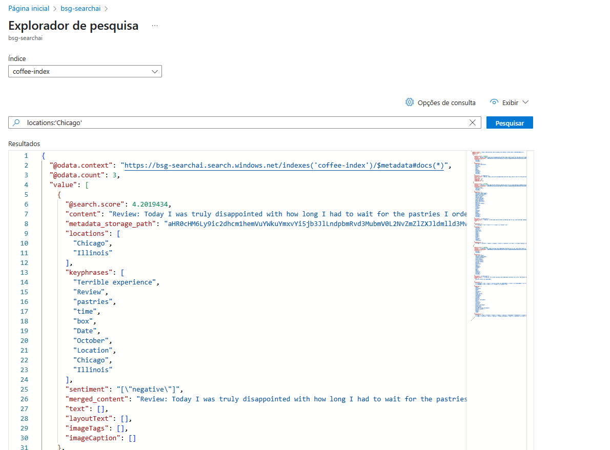
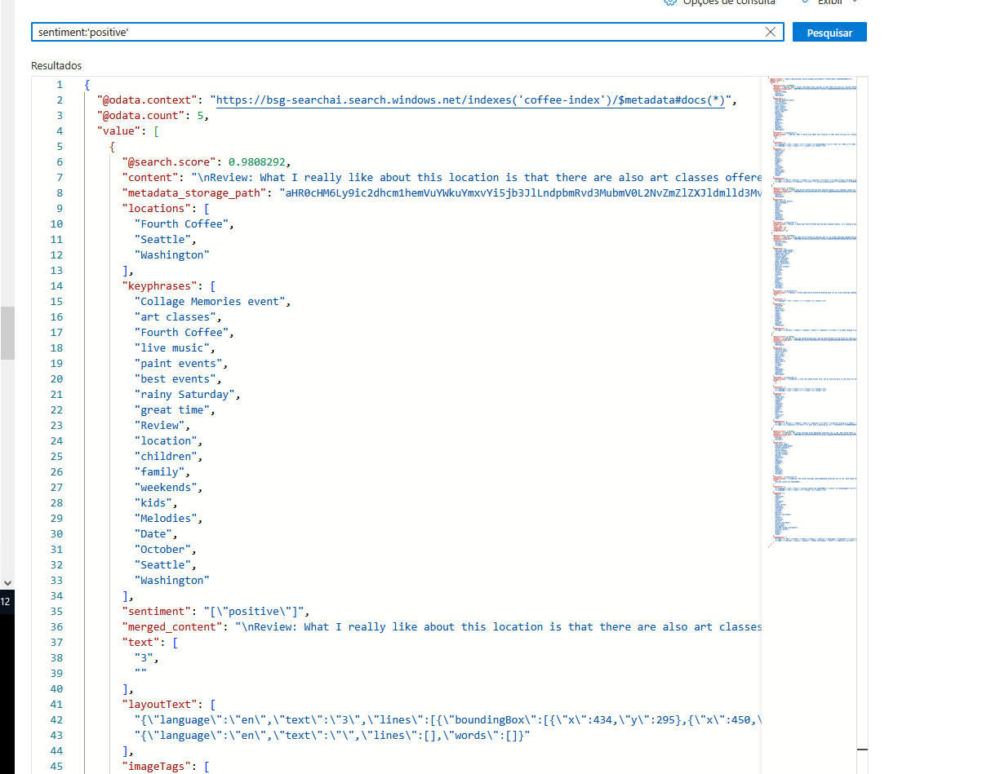
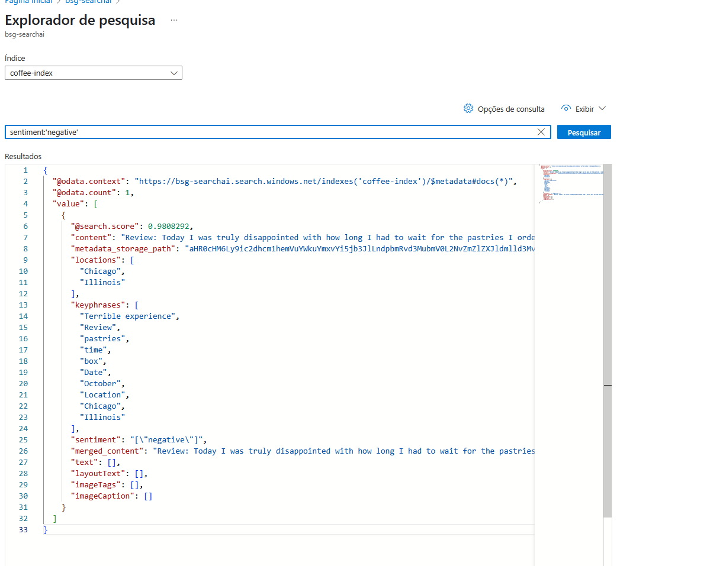

# Azure Cognitive Search: Utilizando AI Search para indexação e consulta de Dados

Esse LAB foi feito seguindo a seguinte documentação: https://microsoftlearning.github.io/mslearn-ai-fundamentals/Instructions/Labs/11-ai-search.html

## Criação de Serviços

### Serviço de Pesquisa
Primeiro, foi criado um serviço de pesquisa:

### Serviço de IA
Depois foi criado um serviço de IA:

### Serviço de Armazenamento
Por fim, foi criado um serviço de armazenamento:

Habilitei o acesso anônimo aos arquivos:

Para poder armazenar os documentos, criei um contêiner:

Após a criação do contêiner, realizei o upload dos arquivos (fornecidos na documentação):

## Importação de Dados
Através de uma série de configurações (das quais acabei não tirando muitos prints), realizei a importação dos dados adicionados anteriormente. Agora, posso usar eles no serviço de pesquisa

## Exeplo de Buscas

### Pesquisa por Localização
Fiz uma breve pesquisa por Chicago, tendo vários resultados:

### Pesquisa por Sentimentos
Pesquisei também por sentimentos positivos (aquilo que a IA entende como sendo algo bom). Foram 5 resultados:

Resolvi pesquisar por sentimentos negativos, para ver se tinha algo de ruim. Tive apenas um resultado:
